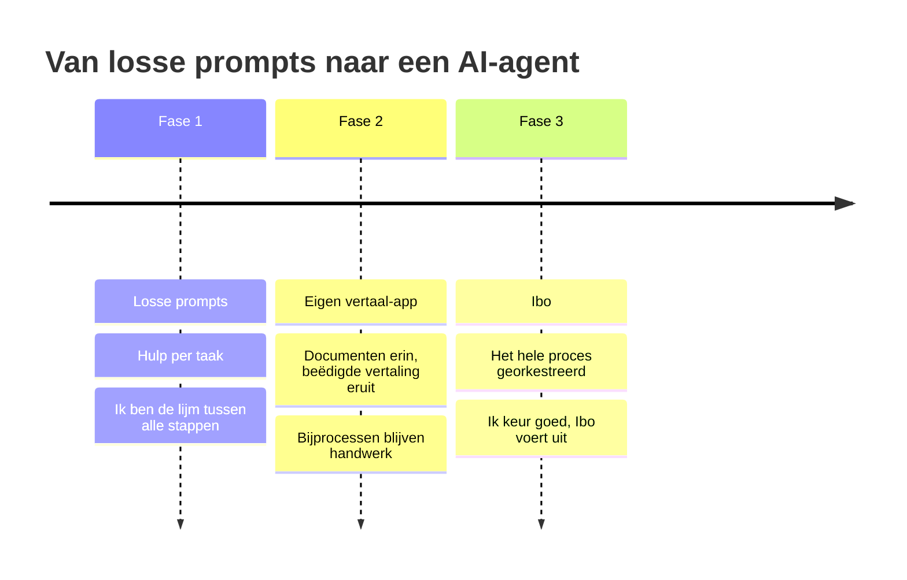
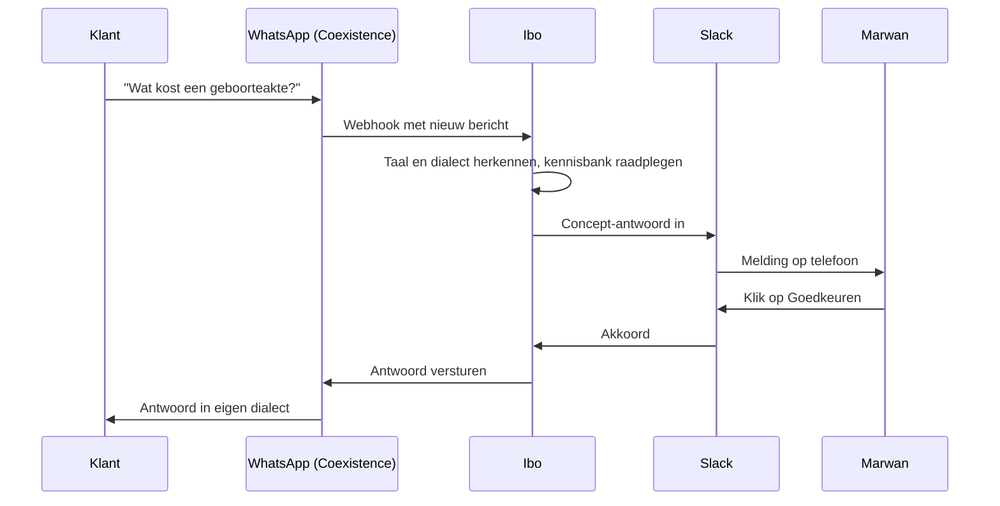

# Hoe Ibo mijn vertaalbureau automatiseerde

*Van losse prompts naar een AI-agent die mijn hele bedrijfsproces orkestreert.*

**Door Marwan Mrait, beëdigd vertaler Arabisch-Nederlands, Al-Bayaan Vertalingen (Eindhoven)**

\---

## Inhoud

* [Een dinsdagochtend, vóór Ibo](#een-dinsdagochtend-vóór-ibo)
* [Mijn routine vóór Ibo](#mijn-routine-vóór-ibo)
* [Fase 1: losse prompts](#fase-1-losse-prompts)
* [Fase 2: mijn eigen vertaal-app](#fase-2-mijn-eigen-vertaal-app)
* [Fase 3: Ibo](#fase-3-ibo)
* [Hoe Ibo werkt, proces voor proces](#hoe-ibo-werkt-proces-voor-proces)
* [De architectuur in één plaatje](#de-architectuur-in-één-plaatje)
* [Wat het me oplevert](#wat-het-me-oplevert)
* [Lessen die ik leerde](#lessen-die-ik-leerde)
* [Begin vandaag](#begin-vandaag)
* [Woordenlijst](#woordenlijst)

\---

## Een dinsdagochtend, vóór Ibo

Het is 9:12 uur. Mijn koffie staat nog onaangeroerd naast het toetsenbord, en mijn telefoon trilt voor de derde keer.

*"Salaamu 3alaykum, wat kost de vertaling van een geboorteakte?"* (in het Arabisch), van een klant uit Aleppo. Daaronder een Nederlands bericht: "Zijn jullie vandaag open?" Daaronder vier foto's van een familieboekje, scheef gefotografeerd en een spraakbericht van twee minuten in Iraaks dialect.

Ik antwoord de eerste klant in het Syrisch, de tweede in het Nederlands. Ik tel de pagina's van het familieboekje, reken een prijs uit, maak een betaallink, download de foto's, hernoem ze, zet ze in een map. Ondertussen komt er een betaling binnen van gisteren, dus ik zoek op welke klant dat was.

Om 12:30 uur heb ik nog geen woord vertaald.

Dat was mijn werkdag. Niet omdat het vertalen zo lang duurde, maar omdat alles eromheen dat deed. Ewa toen besloot ik:

> \[!IMPORTANT]
> \*\*Ik wil vertalen, niet administreren.\*\*

\---

## Mijn routine vóór Ibo

Ik ben beëdigd vertaler Arabisch-Nederlands, ingeschreven in het Register beëdigde tolken en vertalers (Rbtv). Met mijn bureau Al-Bayaan Vertalingen vertaal ik officiële documenten: geboorte- en huwelijksakten, diploma's, familieboekjes, en chatgesprekken die als bewijs dienen. Mijn klanten gebruiken die vertalingen bij de IND, bij gemeenten en bij ambassades.

In mijn vak is precisie alles. Eén verkeerd gespelde naam of een fout omgerekende datum uit de islamitische kalender, en iemands verblijfsaanvraag loopt vertraging op. Mijn stempel en handtekening onder een vertaling betekenen: *hier sta ik persoonlijk voor in.*

Bijna al mijn klantcontact loopt via WhatsApp. Elke dag komen er 4 tot 8 nieuwe aanvragen binnen, in het Nederlands, in standaardarabisch of in dialect: Syrisch, Iraaks, Egyptisch, Marokkaans. Ik antwoord iedereen in zijn eigen taal en dialect. Dat is persoonlijk, en klanten waarderen het enorm. Maar het kost ook tijd.


Zo liep één opdracht, van eerste bericht tot brievenbus:

1. Een WhatsApp-bericht lezen en beantwoorden, in de juiste taal en het juiste dialect.
2. Om duidelijke foto's of scans van de documenten vragen.
3. De documenten bekijken, pagina's tellen, een prijs en levertijd berekenen.
4. Een betaallink maken en versturen.
5. Controleren of er betaald is, en bij wie die betaling hoort.
6. De bestanden downloaden, hernoemen en in een dossiermap zetten.
7. **Vertalen.** De enige value-adding activiteit.
8. Een conceptversie ter controle naar de klant sturen.
9. Feedback verwerken, zoals de spelling van namen volgens het paspoort.
10. Printen, stempelen, ondertekenen.
11. Het postadres opvragen en controleren.
12. Een PostNL-label kopen en de post versturen.
13. De track \& trace-link naar de klant sturen.

En dan was er nog de rest: de website bijhouden, social media, Google Ads-campagnes die ik nauwelijks begreep, en een zoekpositie in Google die ik alleen zag als ik er zelf op zocht.

Van die dertien stappen was er één echt vertaalwerk. De rest noemen we in de softwarewereld **overhead**: werk dat moet gebeuren, maar geen waarde toevoegt aan je vakmanschap. Bij mij kostte dat zo'n 28 uur per week.

\---

## Fase 1: losse prompts

Zoals zoveel mensen begon ik met ChatGPT-achtige assistenten. Een prompt hier, een prompt daar:

* *"Geef alternatieve vertalingen voor deze zin in Standaard-Arabisch."*
* *"Schrijf een vriendelijk antwoord in het Iraakse dialect."*
* *"Wat is 14 Ramadan 1405 in de westerse kalender?"*

Het hielp echt, al controleerde ik elke vertaalde zin natuurlijk zelf. Maar ik merkte al snel iets: **de AI deed losse taken, en ik was nog steeds de lijm ertussen.** Ik kopieerde, plakte, downloadde, hernoemde en controleerde. De assistent was slim, maar had geen geheugen van mijn proces, geen toegang tot mijn systemen, en geen idee wat de volgende stap was. En het belangrijkste van alles; de documenten waar ik mee werk zijn zeer privacy gevoelig en kunnen absoluut niet in een chatbot gezet worden.

> \[!NOTE]
> Losse prompts maken taken sneller. Een \*\*agent\*\* maakt processen sneller. Dat verschil is alles.


\---

## Fase 2: mijn eigen vertaal-app


De volgende stap was een eigen webapplicatie in Python (Flask). Ik sleep er documenten in, kies de taalrichting en een sjabloon, en de app levert een volledig opgemaakt Word-bestand op: de vertaling, de beëdigingsverklaring, mijn stempel en handtekening, en Arabisch en Nederlands netjes in de juiste leesrichting.


Het vertalen zelf ging daardoor tien keer sneller. Belangrijk: de app maakt een eerste versie, geen eindproduct. Ik lees en controleer nog steeds elke vertaling zelf, regel voor regel, met extra aandacht voor namen, datums en officiële termen. Pas daarna zet ik mijn stempel en handtekening.


\### Vertrouwelijkheid by design


De documenten die ik vertaal, horen tot de meest gevoelige die er zijn: paspoorten, geboorteakten, medische verslagen, chatgesprekken voor een rechtszaak. Privacy was daarom geen bijzaak, maar een ontwerpeis vanaf de eerste regel code.


\- \*\*Lokaal opgeslagen.\*\* De app draait op mijn eigen laptop, niet in de cloud. Dossiers staan in lokale mappen, niet in een online opslagdienst of in een chatprogramma.

\- \*\*Alleen verwerkt, nooit bewaard.\*\* Voor het vertalen gaat een document via een versleutelde verbinding (TLS) naar de API van een taalmodel. Dat is de zakelijke API-toegang, waarbij de aanbieder mijn gegevens volgens de voorwaarden niet gebruikt om zijn modellen te trainen. Het resultaat komt terug naar mijn laptop, en daar blijft het.

\- \*\*Dataminimalisatie.\*\* Ibo stuurt alleen wat nodig is voor de taak. In Slack verschijnen bestandsnamen en statusmeldingen, nooit de documenten zelf.

\- \*\*Menselijke eindcontrole.\*\* Geen enkele vertaling verlaat mijn bureau zonder dat ik hem heb gelezen, gecontroleerd en ondertekend.

\- \*\*AVG-proof vastgelegd.\*\* Hoe ik met gegevens omga, staat openbaar in mijn privacyverklaring, inclusief welke diensten als verwerker optreden en hoe lang ik gegevens bewaar.


> \[!IMPORTANT]

> Als beëdigd vertaler heb ik een wettelijke geheimhoudingsplicht. Automatisering verandert daar niets aan: de techniek is zo ingericht dat die plicht altijd voorop staat.


Maar de twaalf andere stappen? Die bleven precies hetzelfde. Mijn telefoon bleef trillen.



\---

## Fase 3: Ibo

Toen kwam Ibo. Ibo is mijn AI-agent: geen chatbot die vragen beantwoordt, maar een digitale collega die het hele proces rond mijn vertaalwerk **orkestreert**. Hij leest mijn WhatsApp, kent mijn prijzen, praat met Stripe, PostNL, Google en mijn eigen vertaal-app, en houdt me via Slack op de hoogte.

### Waarom Slack?

Ibo woont in Slack. Dat klinkt misschien vreemd voor een eenmanszaak, maar het is briljant eenvoudig:

* **Eén plek** voor alles, op mijn laptop en op mijn telefoon.
* **Knoppen.** Onder elk voorstel van Ibo staat een knop: *Goedkeuren*, *Aanpassen*, *Negeren*. Eén tik en het gebeurt.
* **Kanalen per proces**, zodat ik in één oogopslag zie waar iets staat.

### Waarom human-in-the-loop?

Als beëdigd vertaler blijf ik juridisch verantwoordelijk voor alles wat ik lever. Daarom werkt Ibo volgens het principe **human-in-the-loop**: de mens blijft in de lus. Ibo bereidt voor, ik keur goed. Alles wat geld kost of naar een klant gaat, gaat pas de deur uit na mijn klik.

> \[!IMPORTANT]
> Ibo neemt het werk \*rond\* mijn vertalingen over, niet mijn verantwoordelijkheid. Elke vertaling controleer en onderteken ik zelf.

### Slack als controlecentrum

|Kanaal|Wat er gebeurt|
|-|-|
|`#leads`|Elke klant een eigen thread. Berichten komen binnen, Ibo schrijft concept-antwoorden in de taal en het dialect van de klant.|
|`#controle`|Na betaling: per document een akkoordvraag om te vertalen, en een melding zodra de vertaling klaar is.|
|`#verzending`|Adrescontrole, PostNL-labels en track \& trace.|
|`#marketing`|Dagelijkse en wekelijkse rapporten over advertenties en vindbaarheid, met verbetervoorstellen.|
|`#kosten`|Wat de AI mij per dag, week en maand kost.|
|`#systeem`|Starten, stoppen en statusmeldingen.|

\---

## Hoe Ibo werkt, proces voor proces

### De klantreis in één oogopslag

Zo loopt één opdracht nu, van eerste bericht tot brievenbus. De oranje vakken zijn de momenten waarop ik zelf iets doe, de blauwe doet Ibo.

```mermaid
flowchart TB
    subgraph R1\["① Contact en dossier"]
        direction LR
        A\["📱 Klant stuurt<br/>WhatsApp-bericht"] --> B\["🤖 Concept in taal<br/>en dialect"] --> C\["✅ Ik keur goed"] --> D\["📤 Ibo verstuurt"] --> E\["📄 Klant stuurt<br/>documenten"] --> F\["🗂️ Dossier en<br/>pagina-analyse"]
    end
    subgraph R2\["② Betaling en vertaling"]
        direction RL
        G\["✅ Ik keur prijs<br/>en levertijd goed"] --> H\["💳 Stripe-<br/>betaallink"] --> I\["🔔 Betaling<br/>via webhook"] --> J\["✅ Akkoord om<br/>te vertalen"] --> K\["⚙️ Vertaal-app<br/>klaargezet"] --> L\["✍️ Ik controleer<br/>en onderteken"]
    end
    subgraph R3\["③ Levering"]
        direction LR
        M\["📨 Klant keurt<br/>concept goed"] --> N\["📍 Adrescheck<br/>via BAG"] --> O\["✅ Ik bevestig<br/>het adres"] --> P\["🏷️ PostNL-label<br/>en printer"] --> Q\["📦 Track en trace<br/>en reviewverzoek"]
    end
    R1 --> R2 --> R3

    classDef mens fill:#f59e0b,stroke:#b45309,color:#111
    classDef ibo fill:#dbeafe,stroke:#2563eb,color:#111
    class C,G,J,L,O mens
    class A,B,D,E,F,H,I,K,M,N,P,Q ibo
```



### Klantcontact via WhatsApp

**Wat Ibo doet:** hij leest elk nieuw WhatsApp-bericht en schrijft een antwoord in de taal, het dialect en de toon van de klant.

**Hoe hij het doet:** via **Coexistence**. Dat is een officiële functie van Meta waarmee ik de gewone WhatsApp Business-app op mijn telefoon blijf gebruiken, terwijl de **WhatsApp Cloud API** op hetzelfde nummer draait. Berichten en spraakberichten komen via een **webhook** direct bij Ibo binnen. Ibo gebruikt een **kennisbank** met mijn prijzen, levertijden, werkwijze, vaste teksten en tientallen echte, geanonimiseerde voorbeeldgesprekken. Met die kennis schrijft een taalmodel (**LLM**) het concept.

**Details:**

* Ibo herkent het verschil tussen Syrisch, Iraaks, Egyptisch en Marokkaans Arabisch, en tussen een formele en een informele klant.
* Hij reageert alleen op nieuwe berichten, en gebruikt het eerdere gesprek als context.
* Hij **leert van mijn aanpassingen**: elke correctie die ik maak, gebruikt hij als voorbeeld bij het volgende concept.
* Bij spraakberichten laat hij het antwoord aan mij over. Nieuwe klanten krijgen automatisch het label *Lead*.

> \[!TIP]
> Ibo houdt bij hoe vaak ik zijn concepten ongewijzigd goedkeur, per soort bericht. Zo zie ik precies welke berichten hij al zelfstandig aankan.

Zo ziet één klantvraag er van begin tot eind uit:



### Dossier en documentanalyse

**Wat Ibo doet:** hij maakt voor elke klant een nette dossiermap, met de bestanden in de juiste volgorde en met duidelijke namen.

**Details:**

* De map krijgt de naam `jjjjmmdd\_Documentsoort\_12345`, met de laatste vijf cijfers van het telefoonnummer.
* Bij elkaar horende pagina's, zoals zes foto's van één familieboekje, worden gegroepeerd en op volgorde gezet: `Familieboekje\_1` tot en met `Familieboekje\_6`.
* Dubbele bestanden herkent hij aan hun digitale vingerafdruk (**hash**), ook als ze een andere naam hebben.

### Prijs en betaling

**Wat Ibo doet:** hij stelt een prijs en levertijd voor en regelt de betaling.

**Hoe hij het doet:** via de **Stripe API**. Pas nadat ik de prijs heb goedgekeurd, maakt Ibo een betaallink voor precies dat bedrag. Zodra de klant betaalt, stuurt Stripe via een webhook een seintje, en Ibo zet de volgende stap in gang.

**Details:**

* Geen betaallink zonder mijn akkoord op de prijs.
* Na betaling schrijft Ibo direct een bevestiging in de taal van de klant.
* Tegelijk verschijnt per document een akkoordvraag in `#controle`.

### Vertalen

**Wat Ibo doet:** hij zet elk document klaar in mijn vertaal-app, zodat ik alleen nog op *Vertalen* hoef te klikken.

**Hoe hij het doet:** na mijn klik op *Ja* in `#controle` start Ibo zo nodig mijn vertaal-app en opent die met de juiste bestanden, taalrichting en sjabloon al ingevuld. Zodra de vertaling klaar is, meldt de app dat terug aan Ibo. Dat heet een **callback**.

**Details:**

* Meerdere documenten van één klant worden aparte vertalingen.
* Met één knop open ik het resultaat, controleer ik het en onderteken ik het.
* Ibo schrijft meteen het bericht "conceptvertaling ter controle" voor de klant.

### Verzending

**Wat Ibo doet:** van adres tot track \& trace, volledig geregeld.

**Hoe hij het doet:** Ibo zoekt het adres in het WhatsApp-gesprek en controleert het tegen de **BAG**, de officiële adresdatabase van de Nederlandse overheid. Na mijn bevestiging maakt hij via de **PostNL API** een label voor een brievenbuspakje, zet het op het eerstvolgende vrije etiket van mijn A4-etiketvel en stuurt het naar de printer.

**Details:**

* Ibo onthoudt welk etiket op het vel het volgende vrije is, dus een half gebruikt vel gaat gewoon terug in de printer.
* Elke klant komt in een adresboek, zodat een volgende opdracht nog sneller gaat.
* Na afgifte bij PostNL krijgt de klant de track \& trace-link en een vriendelijk verzoek om een Google-review.

### Marketing: Google Ads en Search Console

**Wat Ibo doet:** hij bewaakt mijn advertenties en mijn vindbaarheid, en stelt verbeteringen voor.

**Hoe hij het doet:** via de **Google Ads API** en de **Search Console API**, met veilige toegang via **OAuth 2.0**. Elke ochtend om 09:00 staat er een rapport in `#marketing`, en elke maandag een weekrapport.

**Details:**

* Het weekrapport laat zien hoeveel klanten de advertenties opleverden, gemeten als klikken op de WhatsApp-knop, en wat één klant mij kost.
* Ibo stelt concrete acties voor, elk met een knop: verspilde zoektermen uitsluiten, nieuwe zoekwoorden toevoegen, biedingen aanpassen, budget verschuiven tussen de Nederlandse en de Arabische campagne.
* Hij doet zoekwoordonderzoek met de Zoekwoordplanner van Google, inclusief klikprijzen per zoekwoord.
* Harde regel: Ibo verhoogt nooit zelf mijn budget.

### Het ritme van Ibo

|Wanneer|Wat Ibo automatisch doet|
|-|-|
|Direct|Nieuwe berichten lezen, concepten schrijven, betalingen verwerken|
|Elke ochtend 09:00|Marketingrapport: advertenties, zoekposities en kansen|
|Elke avond 20:00|Kostenoverzicht van de AI|
|Elke maandag|Weekrapport klantenwerving met verbeteracties, nieuwe zoekwoorden, SEO-voorstellen en artikelideeën|

### Website en SEO

**Wat Ibo doet:** hij verbetert mijn website, zodat ik hoger in Google kom zonder te betalen.

**Hoe hij het doet:** Ibo ziet in Search Console op welke zoekwoorden ik net niet bovenaan sta. Hij schrijft betere paginatitels en beschrijvingen, en na mijn klik past hij de code aan, bouwt de site ter controle en publiceert hem via **Vercel**. Dat heet **CI/CD**: automatisch bouwen en uitrollen.

**Details:**

* Mislukt het bouwen, dan zet Ibo automatisch de oude tekst terug. Een **rollback** heet dat.
* Van elke wijziging bewaart hij een reservekopie.
* Elke maandag komt hij met drie nieuwe ideeën voor artikelen in mijn kennisbank, afgestemd op wat mensen zoeken.

### Social media

**Wat Ibo doet:** hij houdt mijn social-mediakanalen actueel.

**Hoe hij het doet:** Ibo stelt berichten voor die aansluiten op mijn website, mijn nieuwste kennisbankartikelen en de zoekwoorden waarop ik wil groeien. Ook hier geldt: ik keur goed, Ibo plaatst.

### Beheer en kosten

**Wat Ibo doet:** hij houdt zichzelf betaalbaar en betrouwbaar.

**Hoe hij het doet:** Ibo gebruikt **LLM-routing**: standaard het goedkoopste taalmodel dat de taak goed kan, met automatisch een reservemodel als een dienst uitvalt. Elke aanroep wordt geregistreerd.

**Details:**

* In `#kosten` zie ik dagelijks wat de AI kost, per taak en per model. Dat is zo'n €8 à €9 per maand.
* Elke actie is **idempotent**: twee keer op dezelfde knop drukken doet niets dubbel.
* Met één commando in `#systeem` start of stop ik alles.

\---

\---

## De architectuur in één plaatje

Ibo is de **orchestration layer**: de dirigent die alle systemen aanstuurt. Zo zijn alle platformen met elkaar verbonden.

```mermaid
flowchart TB
    IBO(("🤖 Ibo<br/>orchestration layer"))

    subgraph COM\["💬 Communicatie"]
        direction TB
        WA\["WhatsApp Cloud API<br/>(Coexistence)"] \~\~\~ SL\["Slack"]
    end
    subgraph PAY\["💳 Betalen"]
        direction TB
        ST\["Stripe"]
    end
    subgraph PROD\["✍️ Productie"]
        direction TB
        APP\["Vertaal-app<br/>(Python / Flask)"] \~\~\~ DOS\["Dossiermappen"]
    end
    subgraph LOG\["📦 Logistiek"]
        direction TB
        PN\["PostNL API"] \~\~\~ BAG\["BAG-adresdatabase"] \~\~\~ PR\["Printer"]
    end
    subgraph MKT\["📈 Marketing"]
        direction TB
        GA\["Google Ads API"] \~\~\~ GSC\["Search Console API"] \~\~\~ VC\["Vercel (website)"] \~\~\~ SOC\["Social media"]
    end
    subgraph AI\["🧠 AI"]
        direction TB
        LLM\["Taalmodellen<br/>(LLM-routing)"] \~\~\~ KB\["Kennisbank"]
    end

    IBO --> COM
    IBO --> PAY
    IBO --> PROD
    IBO --> LOG
    IBO --> MKT
    IBO --> AI

    classDef kern fill:#1e3a8a,stroke:#1e3a8a,color:#fff
    class IBO kern
```

\---

## Wat het me oplevert

**Tijd.** Ik bespaar 28 uur per week aan werk dat niets met vertalen te maken had. Dat is tijd die ik terugkrijg voor mijn vak: vertalen en elke vertaling zorgvuldig zelf controleren.

**Rust.** Mijn telefoon trilt nog steeds. Maar in plaats van zes losse berichten zie ik in Slack zes klaargezette antwoorden, en keur ik ze goed tussen twee vertalingen door.

**Snelheid.** Klanten krijgen binnen een kwartiertje antwoord, in hun eigen taal en dialect. Dat voelt voor hen persoonlijker dan ooit, terwijl het mij minder tijd kost dan ooit.

**Inzicht.** Elke ochtend en elke maandag weet ik precies wat mijn advertenties opleveren, wat een nieuwe klant mij kost en waar mijn website beter kan. Vroeger was marketing voor mij een zwart gat. Nu is het een dashboard.

**Groei.** De tijd die vrijkomt, investeer ik in zakelijke partners en in de uitbreiding naar fysieke locaties. Dingen waar ik vroeger nooit aan toekwam.

### Mijn werk: vóór en na

|Taak|Vóór Ibo|Nu|
|-|-|-|
|💬 Eerste antwoord aan klant|👤 Ik|🤖 Ibo, ik keur goed|
|🌍 Antwoorden in dialect|👤 Ik|🤖 Ibo, ik keur goed|
|📄 Documenten downloaden en hernoemen|👤 Ik|🤖 Ibo|
|🔢 Pagina's tellen en prijs berekenen|👤 Ik|🤖 Ibo, ik keur goed|
|💳 Betaallink maken en betaling controleren|👤 Ik|🤖 Ibo|
|✍️ Vertalen, controleren, ondertekenen|👤 Ik|👤 Ik, met mijn vertaal-app|
|📍 Adres opvragen en controleren|👤 Ik|🤖 Ibo, ik bevestig|
|🏷️ PostNL-label kopen en printen|👤 Ik|🤖 Ibo|
|📦 Track \& trace versturen|👤 Ik|🤖 Ibo|
|📈 Advertenties bijhouden|👤 Ik (nauwelijks)|🤖 Ibo, ik keur acties goed|
|🔎 Website en SEO|👤 Ik (nauwelijks)|🤖 Ibo, ik keur goed|
|📱 Social media|👤 Ik (nauwelijks)|🤖 Ibo, ik keur goed|

> \*"Ik ben niet minder bezig dan vroeger. Ik ben alleen eindelijk bezig met de dingen die ertoe doen."\*

\---

## Lessen die ik leerde

1. **Begin klein.** Ibo begon als één functie: een concept-antwoord op een geplakt WhatsApp-bericht. Elke week kwam er een stukje bij.
2. **Zet een knop op alles wat geld kost of naar een klant gaat.** Automatiseren betekent niet controle opgeven. Mijn goedkeuringsknoppen zijn de reden dat ik Ibo volledig vertrouw.
3. **Eerst meten, dan optimaliseren.** Pas toen ik WhatsApp-klikken apart ging meten, zag ik welke advertenties echt klanten opleverden.
4. **Kies officiële koppelingen boven trucjes.** Een officiële API zoals Coexistence is betrouwbaarder en veiliger dan een workaround die morgen kan breken.
5. **Laat de agent leren van jou.** Elke correctie die ik maak, maakt Ibo beter. Na een paar weken schreef hij antwoorden die ik zelf had kunnen typen.
6. **Houd de kosten zichtbaar.** Door het goedkoopste geschikte model te gebruiken en alles te meten, kost Ibo mij maar €8 à €9 per maand.

\---

## Begin vandaag

Een jaar geleden dacht ik dat AI-agents iets waren voor grote bedrijven met ontwikkelteams. Nu draait mijn eenmanszaak op een digitale collega die nooit slaapt, nooit een bericht vergeet en in vier Arabische dialecten schrijft.

De ondernemers die nu beginnen, bouwen een voorsprong op die over twee jaar nauwelijks nog in te halen is. Elke week dat je wacht, doe je werk dat een agent voor je had kunnen doen.

**Je eerste stap, vandaag nog:** schrijf op papier alle stappen van één opdracht in jouw werk, van eerste contact tot afronding. Zet een sterretje bij elke stap die niets met je eigenlijke vak te maken heeft. Die sterretjes zijn je eerste automatiseringen.

> \[!TIP]
> Je hoeft niet alles tegelijk te automatiseren. Kies de stap die je het vaakst doet en die je het minst leuk vindt. Begin daar.

\---

## Woordenlijst

|Term|Uitleg|
|-|-|
|**AI-agent**|Software die zelfstandig taken uitvoert in meerdere systemen, in plaats van alleen vragen te beantwoorden.|
|**API**|Een officiële koppeling waarmee twee systemen met elkaar praten.|
|**BAG**|De Basisregistratie Adressen en Gebouwen, de officiële adresdatabase van de Nederlandse overheid.|
|**Callback**|Een seintje dat een systeem terugstuurt zodra een taak klaar is.|
|**CI/CD**|Automatisch bouwen, testen en online zetten van software.|
|**Coexistence**|Een functie van Meta waarmee je de WhatsApp Business-app en de officiële WhatsApp API tegelijk op hetzelfde nummer gebruikt.|
|**Event-driven architectuur**|Een systeem dat in actie komt zodra er iets gebeurt, zoals een nieuw bericht of een betaling.|
|**Hash**|Een digitale vingerafdruk van een bestand, waarmee dubbele bestanden herkend worden.|
|**Human-in-the-loop**|De mens blijft betrokken: de AI bereidt voor, de mens keurt goed.|
|**Idempotent**|Een actie die, als je hem twee keer uitvoert, hetzelfde resultaat geeft als één keer.|
|**Kennisbank**|Een verzameling vaste informatie (prijzen, werkwijze, voorbeelden) waarop de AI zijn antwoorden baseert.|
|**LLM**|Large Language Model, het taalmodel dat teksten begrijpt en schrijft.|
|**LLM-routing**|Automatisch het meest geschikte en voordeligste taalmodel kiezen per taak.|
|**OAuth 2.0**|Een veilige manier om een app toegang te geven tot je account, zonder je wachtwoord te delen.|
|**Orchestration layer**|De laag die alle systemen aanstuurt en op elkaar laat aansluiten, zoals een dirigent.|
|**REST-API**|De meest gebruikte vorm van API op het internet.|
|**Rollback**|Automatisch terugzetten naar de vorige versie als er iets misgaat.|
|**SEO**|Zoekmachineoptimalisatie: je website zo inrichten dat je hoger in Google komt.|
|**Vision-AI**|Een taalmodel dat ook afbeeldingen en documenten kan lezen.|
|**Webhook**|Een automatisch seintje van een ander systeem, bijvoorbeeld "er is betaald".|


